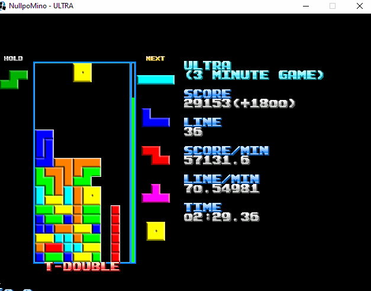
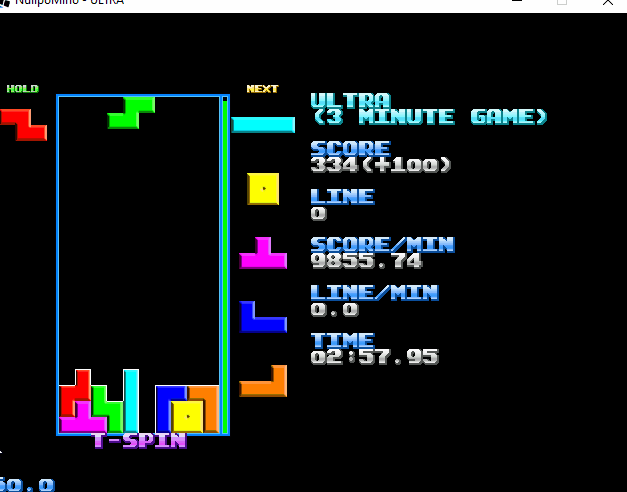
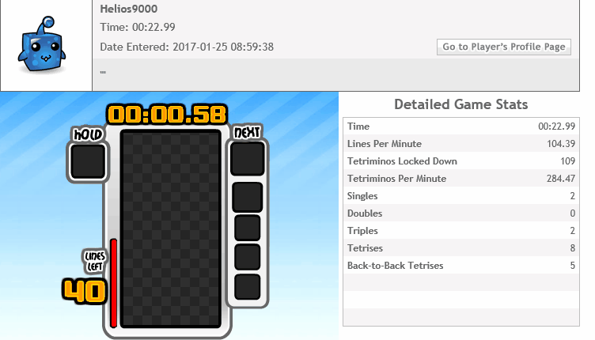
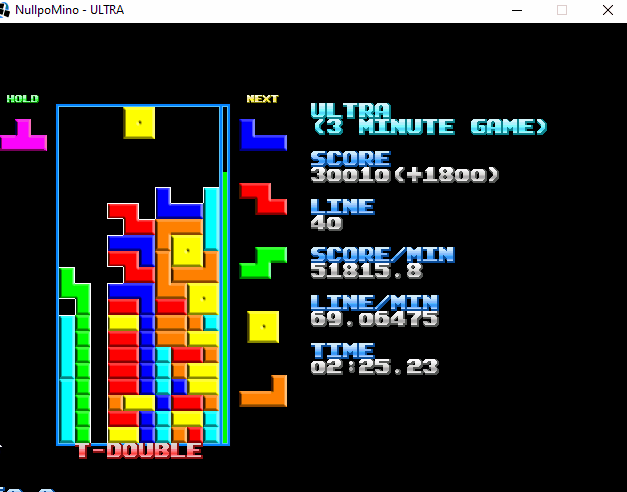

# Ztacker

**Ztacker** is a Tetris bot that utilizes [ST stacking](https://four.lol/stacking/st) to maximise its score in the Tetris Ultra game mode.

## About Ztacker

Ztacker is a bot that was originally developed to play on [Tetris Friends](https://tetrisfriends.com/)'s *Ultra* game mode. The main aim of this game mode is to try and attain the highest score in 2 minutes. The website shut down in 2019, so Ztacker was re-written to work with [Nullpomino](https://github.com/nullpomino/nullpomino), an open-source implementation of Tetris.

While it's primary purpose was to play *Ultra*, due to the precise and fast nature of computer inputs, it did exceedingly well at the *Sprint* game mode. In this game mode the player is tasked with clearing 40 lines as fast as possible. Due to the different nature of the game mode a different strategy than ST stacking was used. For lack of a better term I have referred to it as "Playing Forever", as in theory this technique will allow it to keep playing indefinately. It happened to be faster than ST stacking because it didn't require any "Soft Dropping" of pieces, however it wasn't optimal, but this was made up with by the computer's speed in inputting the moves.

Ztacker held the fastest time on Tetris Friends for the *Sprint* game mode.

> This gif was recorded at 30fps (since it was recording a replay) the others are 15fps since they were recorded in real-time and recording at higher frame rates impacted the performance of the bot. This is why it looks faster despite being the same bot.

- It will choose to mirror the way it would normally use pieces if it finds that more advantageous.

