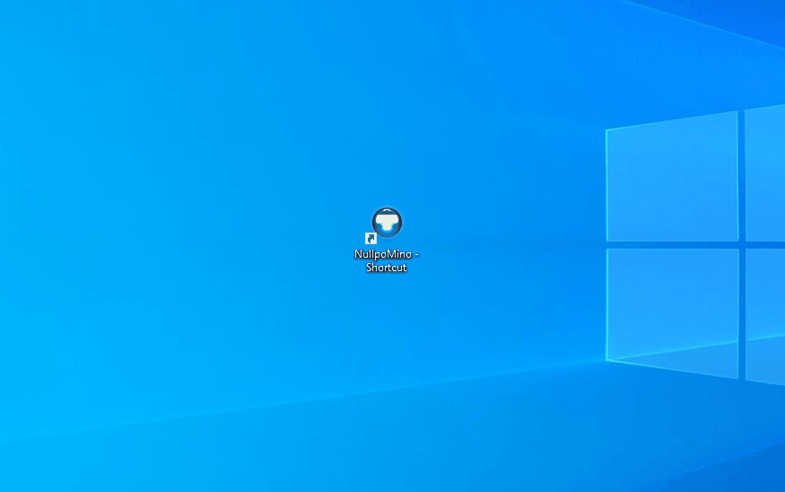
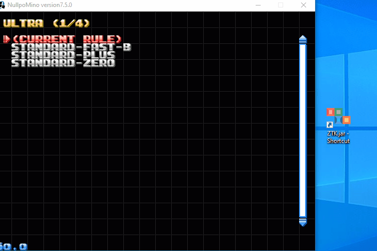
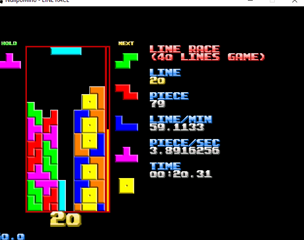

# Ztacker
**Ztacker** is a Tetris bot that uses ST/ZT stacking

- Here's [Nullpomino](https://github.com/nullpomino/nullpomino) an open-source implementation of tetris, its pretty great.

- Now here's Ztacker playing a quick game of tetris.

- Ztacker plays using ST/ZT stacking, a technique that maximizes score obtained per unit time.

- It will choose to mirror the way it would normally use pieces if it finds that more advantageous.

- Ztacker also knows how to use a strategy that will allow it to continue playing forever. Note that a minute has passed yet the grid is in roughly the same position.

- This turns out to be really fast making it useful in the **Sprint** gamemode where you have to clear 40 lines as fast as possible.

- Here's Ztacker's **Sprint** replay on tetris friends, where it held the #1 record of all time until the website shutdown in 2019.

- It also held the #1 spot on the **Ultra** game mode, **Ultra** is about getting the highest score possible in 3 minutes. (2 minutes on tetris friends) That's where ST/ZT stacking shines. This required leaving my computer on overnight playing Tetris for a week.

This project was originally made in 2017.  

note: Ztacker was originally made to play on [tetris friends](https://tetrisfriends.com/), but was re-written to work with Nullpomino since tetris friends shutdown.

